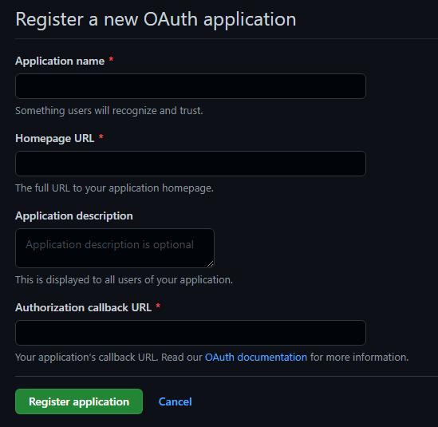

<h3 align="center">
    
</h3>

# Message Sender

Respositório da aplicação desenvolvida durante a 7ª edição da Next Level Week, com algumas pequenas alterações.
Este repositório contém apenas os códigos node (backend) e react (frontend) da aplicação.

## Tecnologias Utilizadas

• [Node.js](https://nodejs.org/)
• [React.js](https://reactjs.org/)
• [Express](https://vitejs.dev/)
• [Axios](https://axios-http.com/)
• [Prisma](https://prisma.io/)
• [Socket.io](https://socket.io/)
• [Vitejs](https://vitejs.dev/)
• [Sass](https://sass-lang.com/)

## Instalação

> Obs.: é necessário ter o node instalado na sua máquina para seguir com a instalação

### Instalação dos pacotes e dependências

Uma vez que existe um frontend e um backend separados, é necessária a instalação das dependências de cada um.

```bash
# Faça o download/clone do repositório
```

> Backend

```bash
# Abra a pasta Heat-node através do terminal

# Execute o seguinte comando para instalar as dependências
npm install
```

> Frontend

```bash
# Abra a pasta Heat-react através do terminal

# Execute o seguinte comando para instalar as dependências
npm install
```

### Configuração do .env e autenticação

> Obs.: Nesta aplicação são utilizados alguns recursos de autenticação do github, portanto é necessário que você tenha uma conta no github para prosseguir.

### Autenticação do github

Para criar o caminho de autenticação

> • Acesse este link: [OAuth Apps github](https://github.com/settings/developers)
> • Clique no botão New OAuth App

E então aparecerá este formulário

<h5 align="center">
    
</h5>

Preencha-o de acordo com dos dados abaixo e ao finalizar, crie a aplicação clicando no botão <strong>Register Aplication</strong>.

```bash
# Application name
nome da sua aplicação

# Homepage URL 
http://localhost:4000

# Application description
descrição da sua aplicação

# Authorization callback URL
http://localhost:3000

```

> • Na próxima tela, clique no botão <strong>Generate New Client Secret</strong> e copie o código que aparecer.

### .env

> Backend

```bash
# Abra o .env do backend cole o código copiado em
GITHUB_CLIENT_SECRET=client_secret_copiado

# Copie o Client ID que aparece no github e cole aqui
GITHUB_CLIENT_ID=client_id_copiado

# O JWT_SECRET pode ser qualquer código, recomendo utilizar um gerador de hash MD5
JWT_SECRET=codigo
```

> Frontend

```bash
# Copie o Client ID que aparece no github e cole aqui
GITHUB_CLIENT_ID=client_id_copiado

VITE_BACK_URL="http://localhost:4000"
```


## Utilização

Novamente, o frontend e o backend são separados, portanto cada um executa em uma porta diferente.

### Criando e acessando as tabelas com o prisma

```bash
# Abra a pasta Heat-node através do terminal

# Execute a criação das tabelas
npx prisma migrate dev

# Execute o gerenciador de banco de dados do prisma
npx prisma studio
```

### Executando a aplicação

> Backend

```bash
# Abra a pasta Heat-node através do terminal

# Execute a aplicação em modo desenvolvedor
npm run dev
```

> Frontend

```bash
# Abra a pasta Heat-react/web através do terminal

# Execute a aplicação em modo desenvolvedor
npm run dev
```
